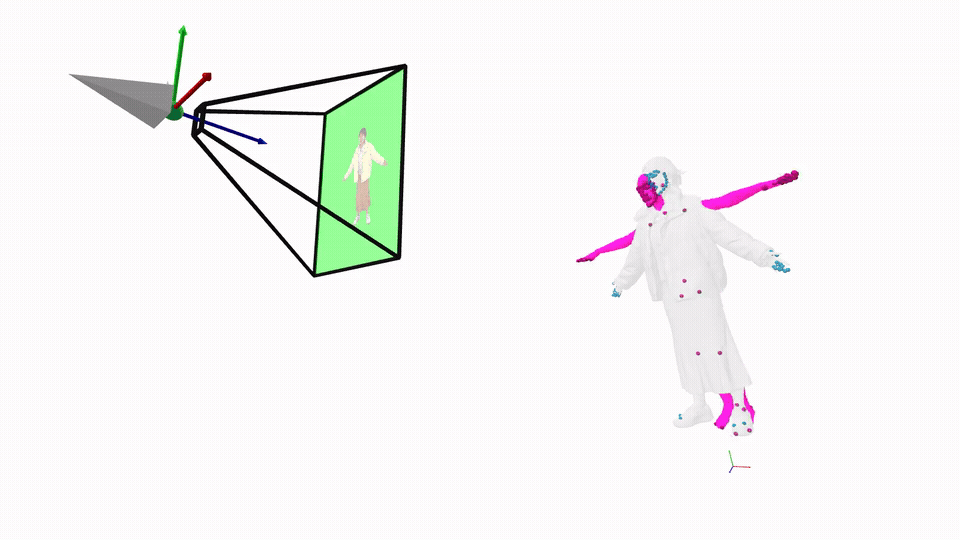

# mesh2smplx

<p align="center">
  
</p>

This codebase is for registering SMPL-X to a
sequence of 3D meshes. It can use real camera images, or render images from the
input meshes, run OpenPose-135, triangulate 3D keypoints, and fit SMPL-X
parameters. AITviewer support is included for local debugging.

This fitting pipeline is used in our [X-Avatar](https://skype-line.github.io/projects/X-Avatar/),
[CustomHumans](https://custom-humans.github.io/), and
[4D-DRESS](https://eth-ait.github.io/4d-dress/) work.

## Install

Python 3.11 is recommended for the local AITviewer UI. We tested the GPU
pipeline with PyTorch 2.5.1 and CUDA 12.1.

```bash
pip install -r requirements.txt
```

For GPU runs, keep the PyTorch and Kaolin lines aligned with the server CUDA
stack. The comments in `requirements.txt` mark optional packages that can be
disabled when users only need part of the pipeline.

## Prepare Data

Create one `data/` folder per sequence. Meshes are required; images and
calibration are optional depending on how 2D keypoints are produced.

You can start from the example archive:

```bash
scripts/download_example_data.sh
```

This downloads `mesh2smplx_example_data.zip` from
<https://huggingface.co/datasets/hohs/mesh2smplx> and extracts it to `data/`.

```text
data/
  meshes/                    # required: mesh sequence to fit
    000000.obj
    000001.obj
  images/                    # optional: real camera images for OpenPose
    cam_000/
      000000.png
      000001.png
    cam_001/
      000000.png
      000001.png
  calibration/               # required only when images/ is used
    cameras.json
  body_shape.npy             # optional: fixed SMPL-family betas
  keypoints_2d/              # generated automatically when missing
  keypoints_3d.npy           # generated automatically, then used by fitting
```

If `images/` is provided, OpenPose runs on those images and `calibration/` must
contain the camera parameters. If `images/` is missing, the pipeline renders
images from the meshes. When calibration is available, those cameras are used for
rendering; otherwise, heuristic cameras are sampled from the upper semi-sphere
around the mesh center.

If `body_shape.npy` is provided, the fitter uses those betas and does not
optimize body shape.

See [data/README.md](data/README.md) for the full data format and generated
pipeline outputs.

### Self-Contained OpenPose-135 Checkpoints

We provide a self-contained OpenPose-135 runner. The weights are downloaded automatically from
<https://huggingface.co/hohs/openpose135-weights> into
`checkpoints/openpose135/`.

## Prepare Body Models

The repository includes an ignored `body_models/` folder for local third-party
assets. Model files are not redistributable with this codebase, so users must
register, accept the upstream licenses, and download them directly:

- SMPL-X: <https://smpl-x.is.tue.mpg.de>
- SMPL: <https://smpl.is.tue.mpg.de>
- SMPL-H / MANO assets: <https://mano.is.tue.mpg.de>

Expected layout:

```text
body_models/
  smpl/
    SMPL_NEUTRAL.pkl
    SMPL_MALE.pkl
    SMPL_FEMALE.pkl
  smplh/
    SMPLH_NEUTRAL.pkl
    SMPLH_MALE.pkl
    SMPLH_FEMALE.pkl
  smplx/
    SMPLX_NEUTRAL.npz
    SMPLX_MALE.npz
    SMPLX_FEMALE.npz
```

### Conversion

For SMPL-X to SMPL conversion, also download the SMPL-X model correspondences
from the SMPL-X downloads page:

```text
body_models/
  transfer/
    smplx2smpl_deftrafo_setup.pkl
    smpl2smplx_deftrafo_setup.pkl
```

Conversion also needs both source and target model files. For example, SMPL-X to
SMPL conversion needs a SMPL-X model in `body_models/smplx/`, a SMPL model in
`body_models/smpl/`, and `body_models/transfer/smplx2smpl_deftrafo_setup.pkl`.

## Launch

For GPU/full-sequence fitting, run:

```bash
scripts/run_gpu.sh configs/gpu.yaml
```

By default, this loads every mesh in `data/meshes/` in sorted filename order. If
`fitting.tracking: true`, frames are fitted sequentially and each frame is
warm-started from the previous result.

Tracking and fixed body shape can be overridden from the launcher:

```bash
scripts/run_gpu.sh configs/gpu.yaml --tracking true --betas data/body_shape.npy
```

For local AITviewer debugging, run:

```bash
scripts/run_local_debug.sh configs/cpu.yaml
```

The debug script defaults to frame index `0` and launches AITviewer. You can pass
a small subset such as `0-5`:

```bash
scripts/run_local_debug.sh configs/cpu.yaml 0-5
```

Both starter scripts accept an optional precomputed 3D keypoint file:

```bash
scripts/run_gpu.sh configs/gpu.yaml data/keypoints_3d.npy
scripts/run_local_debug.sh configs/cpu.yaml data/keypoints_3d.npy 0
```

If `data/keypoints_3d.npy` is missing, the command first generates 2D/3D
keypoints from the configured images or rendered mesh views, then continues into
fitting.


## Licensing And External Assets

The original code and documentation in this repository are marked as
CC-BY-NC-4.0. This does not grant rights to third-party assets or upstream code
with separate license terms.

Users must download SMPL-family models from the official providers and accept
their licenses. OpenPose model weights are not shipped with this repository. If
code is derived from MPI/SMPLify-X fitting components, keep the upstream
non-commercial research license terms and attribution intact.


## References

Our implementation is based on [AITviewer](https://github.com/eth-ait/aitviewer), [Mesh Registration](https://github.com/bharat-b7/RVH_Mesh_Registration), [smplfitter](https://github.com/isarandi/smplfitter).

If find this code useful in your research, please consider citing:

```bibtex
@inproceedings{shen2023xavatar,
  title={X-Avatar: Expressive Human Avatars},
  author={Shen, Kaiyue and Guo, Chen and Kaufmann, Manuel and Zarate, Juan and Valentin, Julien and Song, Jie and Hilliges, Otmar},
  booktitle={Proceedings of the IEEE Conference on Computer Vision and Pattern Recognition (CVPR)},
  year={2023}
}

@inproceedings{ho2023custom,
  title={Learning Locally Editable Virtual Humans},
  author={Ho, Hsuan-I and Xue, Lixin and Song, Jie and Hilliges, Otmar},
  booktitle={Proceedings of the IEEE Conference on Computer Vision and Pattern Recognition (CVPR)},
  year={2023}
}

@inproceedings{wang2024dress,
  title={4D-DRESS: A 4D Dataset of Real-world Human Clothing with Semantic Annotations},
  author={Wang, Wenbo and Ho, Hsuan-I and Guo, Chen and Rong, Boxiang and Grigorev, Artur and Song, Jie and Zarate, Juan Jose and Hilliges, Otmar},
  booktitle={Proceedings of the IEEE Conference on Computer Vision and Pattern Recognition (CVPR)},
  year={2024}
}
```
